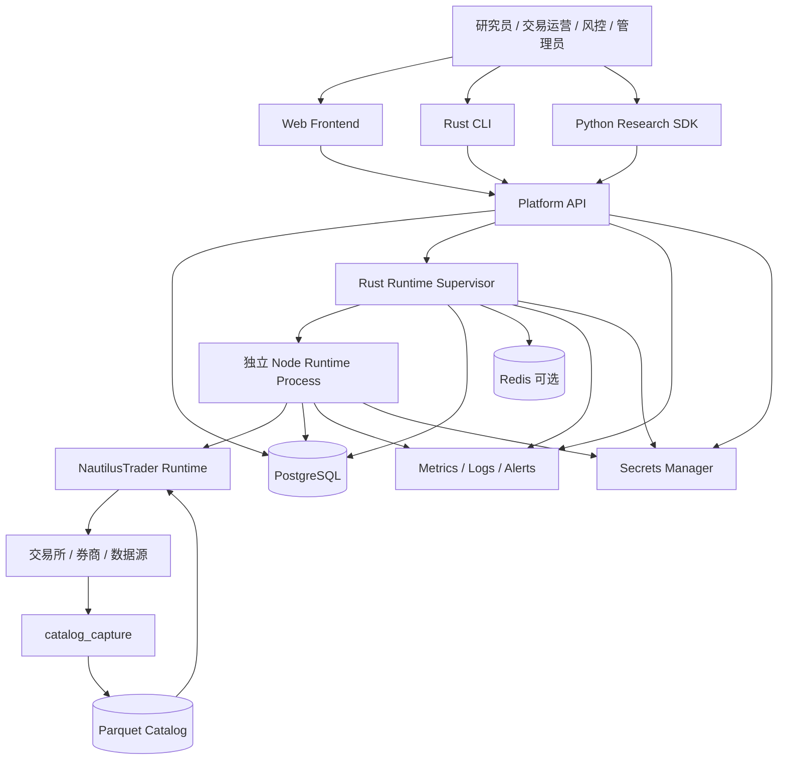
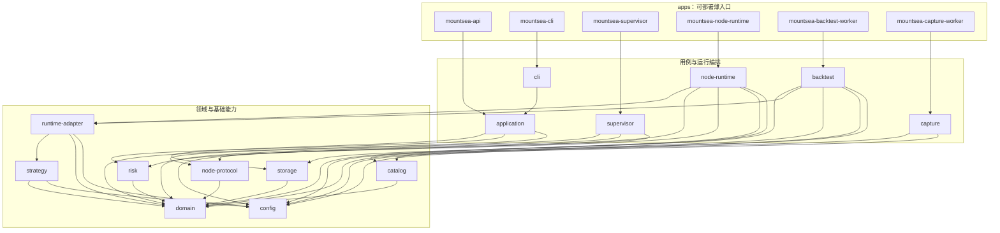

# MountSea 业务与技术架构

## 文档定位

本文基于同级 NautilusTrader 仓库中的以下设计分析，形成当前项目的业务架构和技术架构基线：

- 《NautilusTrader 应用层封装可行性分析》（`application-layer.md`）。
- 《Rust 量化平台实现可行性分析》（`rust-quant-platform.md`）。
- 《交易、行情与持久化成熟度审查》（`trading-data-persistence-maturity.md`）。

上述源文档不属于本仓库，因此这里使用文档名而非仓库内链接。

本文用于项目立项、模块拆分、接口设计、实施排期和阶段验收。它描述目标平台的架构边界，
不表示 NautilusTrader 已经原生提供本文全部平台能力。

## 决策摘要

| 主题 | 架构决策 |
| --- | --- |
| 平台定位 | MountSea 是构建在 NautilusTrader 之上的 Rust-first 应用层和控制面，不重写交易引擎。 |
| 代码组织 | `apps/` 保存可部署的薄入口，`crates/` 保存按功能命名的可组合库。 |
| 运行拓扑 | `mountsea-api → mountsea-supervisor → mountsea-node-runtime → LiveNode`；一个进程只承载一个并发 `LiveNode`。 |
| 默认边界 | 同一账户默认由一个 Node 管理多个策略和资产；跨 Node 共享账户属于后续能力。 |
| 数据存储 | 历史行情使用 Parquet Catalog，平台事务与交易恢复状态使用 PostgreSQL，临时状态可使用 Redis。 |
| 安全上线 | 回测、Sandbox、Venue 验收、小资金实盘和扩容均需通过独立 Gate。 |
| 初始交付 | 先完成单账户、单或少量 Venue、纯 Rust 策略的端到端闭环。 |

## 阅读导航

- [架构目标](#1-架构目标)：愿景、原则和非目标。
- [业务架构](#2-业务架构)：角色、能力、对象、状态机和业务规则。
- [技术架构](#3-技术架构)：系统上下文、分层、Workspace 和集成边界。
- [运行时与 Supervisor 架构](#4-运行时与-supervisor-架构)：进程拓扑、IPC 和健康模型。
- [数据架构](#5-数据架构)：存储边界、持久化风险和数据流。
- [API 与接口架构](#6-api-与接口架构)：API 分层、资源和错误语义。
- [安全架构](#7-安全架构)：身份、构建、网络和进程安全。
- [可观测性与可靠性](#8-可观测性与可靠性)：指标、告警、备份和恢复。
- [部署架构与容量](#9-部署架构与容量)：部署方式、容量基线和资源隔离。
- [实施路线和验收 Gate](#10-实施路线和验收-gate)：实施阶段和验收条件。

## 1. 架构目标

### 1.1 项目愿景

建设一个 Rust-first 的量化策略生命周期平台，覆盖：

```text
数据采集与治理
    ↓
策略研究与版本管理
    ↓
回测与结果分析
    ↓
Sandbox 验证
    ↓
小资金实盘发布
    ↓
运行监控、对账、复盘和迭代
```

平台以 NautilusTrader 作为交易运行时，以 `catalog_capture` 和兼容的
`ParquetDataCatalog` 作为历史行情基础设施，以 PostgreSQL 保存平台事务和交易状态，以
Rust Supervisor 管理隔离的交易 Node。

### 1.2 设计原则

1. **Rust-first。** 平台服务、Worker、Supervisor、Node Runtime 和可靠性边界优先使用 Rust。
2. **核心复用。** 复用 NautilusTrader 的订单状态机、RiskEngine、ExecutionEngine、Portfolio、
   DataEngine、BacktestEngine 和 Adapter，不在平台层重写交易核心。
3. **研究兼容。** 保留 Python、Notebook、Polars 和可视化能力，不以技术统一牺牲研究效率。
4. **单节点优先。** 先完成单 Node 闭环，再扩展多 Node 编排和跨账户组合管理。
5. **证据优先。** 订单未知结果、对账、持久化和恢复都必须保留原始证据。
6. **数据分层。** 高频历史行情、平台事务数据、交易状态和临时运行状态使用不同存储。
7. **渐进上线。** 回测、Sandbox、Venue 验收、小资金实盘和扩大资金必须有明确 Gate。
8. **故障安全。** 进程存活不等于交易安全，数据库、行情、订单和对账状态必须分别检查。

### 1.3 非目标

第一阶段不建设大型多租户 SaaS、跨所有交易所的统一终端、Event Store 唯一灾备、未验收
Venue 的自动实盘托管、高频行情逐条写 PostgreSQL，或绕过 NautilusTrader 风控和执行引擎
的交易通道。

## 2. 业务架构

### 2.1 业务角色

| 角色 | 主要职责 |
| --- | --- |
| 研究员 | 管理数据集、开发策略、提交回测、分析结果。 |
| 策略开发者 | 创建策略版本、配置参数、修复策略和发布构建产物。 |
| 交易运营 | 管理账户、运行实例、订单、持仓和异常处理。 |
| 风控人员 | 配置限额、审批发布、处理熔断和人工接管。 |
| 平台管理员 | 管理用户、权限、Venue、基础设施和系统配置。 |
| 审计人员 | 查询操作、发布、订单、Venue Report 和对账证据。 |
| Supervisor | 执行生命周期、健康检查、资源控制和恢复编排。 |

### 2.2 业务能力地图

```text
量化策略平台
├── 身份与权限：用户、团队、账户、凭证和审批
├── 数据与研究：数据源、数据集、策略、回测、报告和复现
├── 交易运行：Sandbox、Live、Node、订单、持仓、对账和恢复
├── 组合与风险：资金分配、限额、熔断、Cancel-all 和 Kill Switch
└── 运维与审计：日志、指标、告警、发布、Venue 验收和生命周期审计
```

### 2.3 核心业务对象

```text
Organization / User / Role / TradingAccount / CredentialReference
VenueProfile / StrategyProject / StrategyVersion / StrategyArtifact
Dataset / DatasetVersion / BacktestJob / BacktestRun / BacktestResult
Deployment / RuntimeInstance / NodeProcess / RiskPolicy / Approval
ReconciliationCase / VenueReport / AuditRecord / Alert
```

平台对象描述管理、版本和审批状态；NautilusTrader 对象描述真实策略、订单、账户和市场状态。

### 2.4 核心业务状态机

```text
Strategy: Draft → Validated → Built → Approved → Published → Deprecated
Dataset: Created → Capturing → Sealed → Validating → Committed → Retired
Backtest: Created → Validated → Queued → Running → Completed / Failed / Canceled
Runtime: Draft → Approved → Starting → Reconciling → Running → Stopped / Failed
```

只有通过校验、构建、审批和对应验收 Gate 的版本才能进入下一阶段。`Failed`、`Degraded`
和 `ReconciliationBlocked` 不能直接恢复为 `Running`。

### 2.5 端到端业务闭环

```text
注册并校验数据集
    ↓
注册并构建策略版本
    ↓
Rust BacktestWorker 执行回测
    ↓
保存订单、成交、仓位、PnL 和复现元数据
    ↓
发布 Sandbox Deployment 并完成故障注入
    ↓
目标 Venue 能力矩阵和风险审批通过
    ↓
发布 Live Deployment
    ↓
启动 Node、连接 Venue、完成 Reconciliation
    ↓
小资金灰度、监控、复盘和版本迭代
```

故障恢复必须先停止新增敞口，必要时撤单或人工接管，再恢复本地状态、处理 Unknown Outcome、
完成 Venue 对账，最后由人工或策略化 Gate 决定是否恢复策略。

### 2.6 关键业务规则

1. 订单入口保持 `Strategy → RiskEngine → ExecutionEngine → ExecutionClient → Venue`。
2. 网络超时和发送后断开不能直接映射为交易所拒单。
3. 同一账户默认由一个 Node 管理多个策略和资产。
4. 多 Node 共同操作账户前必须具备账户级集中风控、订单归属和跨 Node 对账。
5. 一个进程只运行一个并发 `LiveNode`，多个 Node 必须由 Supervisor 独立进程管理。
6. 一个 Node 可以注册多个 Strategy、Data Client 和 Execution Client，一个 Strategy 可以交易多个 Instrument。
7. PostgreSQL Cache 入队不等于 Durable Commit，必须展示持久化 Lag。
8. 关键审计独立保存原始 Venue Report、命令、对账输入和决策，不能只依赖 Event Store。

## 3. 技术架构

### 3.1 系统上下文



### 3.2 总体分层

```text
Presentation Layer
  Web、Rust CLI、Python SDK、Notebook

Application Layer
  Identity、Strategy、Dataset、Backtest、Deployment、Approval、Audit

Control Plane
  Platform API、Scheduler、Worker、Runtime Supervisor、Risk Coordinator

Runtime Adapter Layer
  平台配置 ↔ NautilusTrader 配置、Strategy Factory、Client Factory、版本隔离

Trading Runtime Layer
  NautilusTrader BacktestEngine、Sandbox/LiveNode、DataEngine、RiskEngine、
  ExecutionEngine、Portfolio、Cache、MessageBus

Data Infrastructure Layer
  catalog_capture、ParquetDataCatalog、PostgreSQL、Redis、Object Storage

External Layer
  Venue Adapter、交易所、券商、数据源、Secrets Manager、监控基础设施
```

### 3.3 Rust Workspace

MountSea 采用独立 Rust Workspace，不把应用层大规模加入 NautilusTrader 主仓库。Workspace
按可部署应用和可复用能力分层：

```text
mountsea/
├── Cargo.toml
├── apps/                         # 薄入口：配置、装配、启动和关闭
│   ├── api/
│   ├── cli/
│   ├── supervisor/
│   ├── node-runtime/
│   ├── backtest-worker/
│   └── capture-worker/
├── crates/                       # 按功能命名的可组合库
│   ├── application/
│   ├── domain/
│   ├── config/
│   ├── storage/
│   ├── catalog/
│   ├── runtime-adapter/
│   ├── node-protocol/
│   ├── risk/
│   ├── strategy/
│   ├── supervisor/
│   ├── node-runtime/
│   ├── backtest/
│   ├── capture/
│   └── cli/
├── migrations/
├── configs/
├── examples/
├── python/
└── frontend/
```

应用二进制使用 `mountsea-*` 命名，库仅使用功能名称，不携带 `mountsea` 或 `platform` 前缀。
`apps/` 不承载领域逻辑，只完成依赖装配并调用相应库。由此可组合出研究回测工具、Sandbox、
单机交易系统和完整 Web 平台，同时保持核心能力可复用。

库化不会取消进程安全边界。生产环境中的 `LiveNode` 仍由独立的 `mountsea-node-runtime`
进程承载，Supervisor 通过版本化 IPC 管理它。

### 3.4 应用模块职责

`apps/` 中的模块是部署单元，不提供可复用业务能力。它们只能完成配置读取、依赖注入、协议
暴露、进程启动、信号处理和优雅关闭。

| 模块 | 作用 | 业务范围 | 不负责 | 直接依赖 |
| --- | --- | --- | --- | --- |
| `apps/api` | 启动 MountSea Web 服务，装配 HTTP、WebSocket、认证和可观测性。 | 用户、策略、数据集、回测、部署、审批、运行状态和审计 API。 | 领域决策、交易执行、进程监督和 SQL 细节。 | `application` |
| `apps/cli` | 提供本地和运维命令入口，解析参数并输出结果。 | 数据集管理、提交回测、部署控制、诊断和管理命令。 | 复制 API 或 Application 用例逻辑。 | `cli` |
| `apps/supervisor` | 启动 Supervisor 守护进程并装配操作系统资源。 | Node 子进程管理、心跳、健康检查、恢复、对账 Gate 和 Kill Switch 编排。 | Node 内订单状态机、Portfolio 计算和 Venue 协议。 | `supervisor` |
| `apps/node-runtime` | 启动单个隔离交易 Node。 | 加载一个 Deployment，构建一个 `LiveNode`，注册策略和 Adapter，响应 Supervisor IPC。 | 多 Node 调度、Web API 和平台审批。 | `node-runtime` |
| `apps/backtest-worker` | 启动隔离的回测 Worker。 | 领取一个 BacktestJob，加载固定版本数据和策略，执行并保存结果。 | 交互式研究、任务排队策略和实盘交易。 | `backtest` |
| `apps/capture-worker` | 启动行情采集 Worker。 | 连接数据源、分段采集、校验并提交 DatasetVersion。 | 策略交易、回测调度和 Catalog 查询 API。 | `capture` |

应用包使用 `mountsea-*` 名称，是为了标识 MountSea 官方二进制。其他交易系统可以直接组合
`crates/` 中的库，建立不同的应用入口，而不依赖这些二进制包。

### 3.5 核心库职责

| 模块 | 核心作用 | 业务范围 | 边界与禁止事项 | 直接依赖 |
| --- | --- | --- | --- | --- |
| `domain` | 定义稳定的领域语言和业务不变量。 | Strategy、Dataset、Backtest、Deployment、Runtime、Approval、风险与对账状态机，以及 ID、值对象和领域错误。 | 不依赖数据库、Web、NautilusTrader 或操作系统；不执行 I/O。 | 无 |
| `config` | 加载、合并并校验配置。 | 平台、Worker、Supervisor、Node、Venue 和风险配置，环境覆盖与版本校验。 | 不启动服务，不读取业务数据，不包含领域流程。 | 无 |
| `storage` | 定义并实现平台持久化边界。 | Repository、事务、PostgreSQL 映射、审计记录和运行状态查询。 | 不复制 NautilusTrader 的订单状态机；不保存高频原始行情。 | `domain` |
| `catalog` | 管理版本化历史数据。 | DatasetVersion、Manifest、Partition、Checksum、WriterLease、CommitMarker 和读取定位。 | 不承担平台事务数据库职责；未提交版本不能对正式读者可见。 | `domain` |
| `risk` | 提供平台级风险规则。 | 账户、策略和组合限额，Stop-new-exposure、Cancel-all、Kill Switch 及风险判定。 | 不替代 Node 内 NautilusTrader RiskEngine，不直接向 Venue 发单。 | `domain` |
| `strategy` | 定义可复用的策略开发契约和注册机制。 | StrategyDescriptor、参数 Schema、能力声明、版本元数据、配置校验、策略工厂接口和工厂注册表。 | 不管理策略项目审批和构建发布；不启动引擎；不直接连接数据库、网络或 Venue。 | `config`、`domain` |
| `runtime-adapter` | 隔离 MountSea 与 NautilusTrader 的版本和类型差异。 | 将已校验配置、策略工厂和 Client 工厂转换为 BacktestEngine 或 LiveNode 所需对象。 | 不处理平台审批、任务排队和进程生命周期。 | `config`、`domain`、`strategy` |
| `node-protocol` | 定义 Supervisor 与 Node 的稳定通信契约。 | 命令、事件、状态、版本协商、关联 ID、错误和 `Unknown` 结果语义。 | 只定义协议和序列化，不 spawn 进程，不执行命令。 | `domain` |
| `application` | 编排面向用户的平台用例和事务边界。 | 策略、数据集、回测、部署、审批、查询、权限、审计和幂等流程。 | 不包含 HTTP/CLI 表现逻辑，不直接依赖具体进程入口，不实现交易引擎。 | `domain`、`risk`、`storage` |
| `supervisor` | 提供可嵌入的运行实例监督能力。 | 子进程生命周期、IPC 会话、心跳、资源与队列监控、恢复和 Reconciliation Gate。 | 不承载 Web 路由，不运行策略，不实现 Venue Adapter。 | `config`、`domain`、`node-protocol` |
| `node-runtime` | 提供可组合的单 Node 运行能力。 | Deployment 加载、LiveNode 构建、策略注册、运行控制、状态上报和安全停止。 | 一个实例只拥有一个并发 `LiveNode`；不管理其他 Node。 | `config`、`domain`、`node-protocol`、`risk`、`runtime-adapter` |
| `backtest` | 提供可组合的确定性回测执行能力。 | 校验 BacktestJob、读取已提交数据集、构建引擎、执行、取消、结果和复现元数据。 | 不负责队列产品选型、HTTP 接口或实盘生命周期。 | `catalog`、`config`、`domain`、`runtime-adapter`、`storage` |
| `capture` | 提供可组合的行情采集和发布能力。 | 数据源连接、分段、校验、Promotion、Manifest 和 CommitMarker。 | 不进行策略计算和交易，不绕过 Catalog 发布协议。 | `catalog`、`config` |
| `cli` | 提供与终端无关的命令用例适配。 | 将命令映射到 Application 用例，统一输入、输出和错误展示模型。 | 不解析 HTTP，不直接访问数据库，不承载领域规则。 | `application` |

以上“直接依赖”与当前 Cargo Workspace 清单保持一致。随着端口和 Adapter 落地，可以增加实现
crate，但不得破坏下节的依赖方向。

### 3.6 模块依赖方向



依赖规则如下：

1. `apps → orchestration crates → capability crates → domain`，依赖只能向内，不允许反向引用。
2. `domain` 和 `config` 位于依赖底部；`domain` 必须保持纯业务模型，`config` 不承载业务规则。
3. `application` 通过 Repository 和控制端口表达需求。基础设施实现可以注入用例，但领域层不能
   依赖 PostgreSQL、Axum、IPC 或 NautilusTrader 类型。
4. `supervisor` 与 `node-runtime` 只能共享 `node-protocol` 契约，不得互相形成编译期依赖。
5. `strategy` 定义运行时无关的策略契约，`runtime-adapter` 负责将契约映射到 NautilusTrader。
   `backtest` 与 `node-runtime` 复用同一 Adapter，确保策略配置和引擎构建语义尽量一致。
6. 跨进程调用不是 Rust crate 直接调用。API、Supervisor、Node 和 Worker 通过持久化任务、队列
   或版本化协议协作，以保留隔离、重试和审计能力。
7. 禁止为了方便从基础库反向调用 `application`，也禁止应用入口被其他库作为依赖。

### 3.7 关键业务调用链

#### Web 管理请求

```text
Web / SDK
  → mountsea-api
  → application 用例
  → domain / risk 判定
  → storage 事务与审计
  → 返回资源状态或异步任务 ID
```

API 只接受和编排平台请求。涉及运行进程的操作应写入可审计的命令或任务，再由 Supervisor 或
Worker 消费，不能从 HTTP Handler 直接调用交易所。

#### 实盘部署与运行控制

```text
mountsea-api → application → storage：创建并审批 Deployment
mountsea-supervisor → supervisor → storage/任务源：领取已批准 Deployment
supervisor → node-protocol → mountsea-node-runtime：启动并下发版本化命令
mountsea-node-runtime → node-runtime → runtime-adapter → NautilusTrader LiveNode
LiveNode → Venue Adapter → Venue
```

其中 `storage/任务源` 表示运行时集成阶段需要注入的平台状态仓库或队列端口，不表示
`supervisor` 必须把 SQL 查询写进核心逻辑。

#### 回测任务

```text
Web / CLI → application → storage：创建 BacktestJob
mountsea-backtest-worker → backtest：领取并校验任务
backtest → catalog：读取已提交 DatasetVersion
backtest → runtime-adapter → strategy：解析工厂并构建 BacktestEngine 和 Strategy
backtest → storage：保存状态、结果索引、指标和复现元数据
```

#### 行情采集与数据发布

```text
mountsea-capture-worker → capture → Data Provider
capture → catalog：写临时分片、校验、生成 Manifest 和 CommitMarker
catalog → domain：更新 DatasetVersion 状态
已提交 DatasetVersion → backtest / research reader
```

#### 运维 CLI

```text
Operator → mountsea-cli → cli → application
```

CLI 与 Web API 共享 Application 用例和权限语义。远程部署时，CLI 也可以改为调用 Public API，
但不应另建一套领域流程。

### 3.8 NautilusTrader 集成边界

平台通过 Runtime Adapter 依赖固定版本或 Git Commit 的 NautilusTrader 公开入口：

```text
StrategyVersion → Validated RuntimeConfig → Runtime Adapter
    → NautilusTrader Types and Factories
    → BacktestEngine / LiveNode
```

平台不重新实现订单状态机、交易所协议、精确数值计算、订单级 RiskEngine、ExecutionEngine、
Portfolio、DataEngine、Venue Adapter 和 Node 内 MessageBus Dispatch。平台只补充组织、账户、
组合级风险、发布审批、进程监督、跨 Node 汇总、审计和恢复 Gate。

## 4. 运行时与 Supervisor 架构

### 4.1 三个 Rust 运行面

```text
mountsea-api
    ↓ 创建 Deployment、审批、查询和控制
mountsea-supervisor
    ↓ spawn、IPC、监控、对账 Gate 和恢复编排
mountsea-node-runtime
    ↓ LiveNode::builder → add_strategy → run
NautilusTrader LiveNode
```

### 4.2 Node 拓扑

```text
Runtime Supervisor
├── Node Process A → Account A → Strategy A1 + Strategy A2
├── Node Process B → Account B → 多资产策略
└── Node Process C → 独立 Venue 或高负载策略
```

同一 Node 共享 Cache、Portfolio、RiskEngine、ExecutionEngine、MessageBus、CPU、内存和故障域。
同一账户默认由一个 Node 管理多个策略和资产。多个 Node 共同操作账户前，必须具备账户级
集中风控、订单归属、Portfolio 汇总和跨 Node 对账。

### 4.3 Supervisor 职责

Supervisor 负责版本化 Deployment、凭证引用、隔离目录、Node 子进程、IPC、心跳、资源指标、
Queue、持久化 Lag、Kill Switch、生命周期审计、恢复和 Reconciliation Gate。

Supervisor 不负责订单状态机、交易所 API、订单级风控、Portfolio 计算或 Venue Reconciliation
的底层实现，而是调用 Node 和 NautilusTrader 提供的能力进行平台级编排。

### 4.4 Node IPC

MVP 推荐本机 TCP 加版本化 JSON 或 Protobuf；Linux 可以评估 Unix Domain Socket，需要强类型
和扩展时可以使用 gRPC。协议包含 `protocol_version`、`deployment_id`、`runtime_instance_id`、
`node_id`、`request_id` 和时间戳，并区分 `Accepted`、`Succeeded`、`Failed`、`InProgress`、
`Unknown` 和 `Rejected`。

### 4.5 健康模型

```text
Process Health → Runtime Health → Trading Health → Persistence Health → Reconciliation Health
```

只有进程、运行时、行情和订单、持久化以及对账均满足要求，RuntimeInstance 才可以标记为
`Running`。Supervisor 或基础设施重启后，不得跳过对账直接恢复真实交易。

## 5. 数据架构

### 5.1 数据分类与存储边界

| 数据类别 | 推荐存储 | 主要内容 | 一致性定位 |
| --- | --- | --- | --- |
| 研究和交易大数据 | Parquet、Object Storage | Quotes、Trades、OrderBook、Bars、回测结果和 Equity Curve。 | 版本化文件数据集。 |
| 平台事务数据 | PostgreSQL | 用户、项目、策略版本、任务、部署、审批、权限和审计。 | 事务数据库。 |
| 交易状态恢复 | NautilusTrader Cache Backing、PostgreSQL | Currency、Instrument、Account、Order 和 Position。 | 异步恢复状态，不是共识层。 |
| 实时临时状态 | Redis 或有界内存 | 心跳、短锁、WebSocket 状态和临时控制命令。 | 可丢失或可重建。 |
| 原始交易证据 | PostgreSQL、Object Storage 或独立审计存储 | Venue Report、Execution Command、Reconciliation Input 和 Decision。 | 不依赖 Event Store 唯一保存。 |
| 指标和日志 | Prometheus、日志存储 | 运行指标、错误、告警和生命周期记录。 | 可观测性数据。 |

### 5.2 PostgreSQL 设计原则

平台事务库和 NautilusTrader Cache Backing 应使用独立 Schema、数据库或至少独立权限边界。
建议核心表包括：

```text
organizations
users
roles
trading_accounts
credential_references
venue_profiles
strategy_projects
strategy_versions
strategy_artifacts
datasets
dataset_versions
backtest_jobs
backtest_runs
deployments
runtime_instances
risk_policies
approvals
reconciliation_cases
audit_records
alerts
```

交易状态 Cache 表由 NautilusTrader 迁移和实现负责，平台不要复制其订单和仓位状态机。平台
可以保存跨 Node 的索引、汇总和审计引用，但不能把汇总视为交易所最终状态。

### 5.3 PostgreSQL Cache 风险

当前 PostgreSQL Cache Backing 通过无界异步通道写入，缓冲间隔为零并逐条执行数据库操作。
数据库变慢时，交易核心可能暂时继续运行，但待写对象会积压并增加 Node RSS。成功入队也不
等于 Durable Commit，进程崩溃可能发生尾部写入丢失。

Supervisor 必须监控：

- 写入错误数量。
- 最后成功提交时间。
- 待写数量和最旧待写消息年龄。
- PostgreSQL 连接池、锁等待和事务延迟。
- WAL 增长、Checkpoint、Autovacuum 和磁盘空间。
- Node RSS 增长斜率。

持久化持续落后时，平台应依次考虑停止非必要行情落盘、停止新增敞口、有序停止 Node，
并在恢复后执行完整对账。

### 5.4 Parquet Catalog 发布协议

Parquet Catalog 适合历史行情、研究和回测，但一次 Promotion 可能生成多个文件，不能天然
提供事务快照。平台在 Catalog 之上实现：

```text
DatasetVersion
    ↓
Manifest + Partition List
    ↓
Checksum + ValidationStatus
    ↓
CommitMarker
    ↓
Reader 可见
```

写入流程：

1. 创建未发布 DatasetVersion。
2. 获取对应 Partition 的 WriterLease。
3. 写入临时目录和分片文件。
4. 执行 Schema、时间范围、重复、缺口和回读校验。
5. 生成 Manifest 和 Checksum。
6. 写入 CommitMarker。
7. 原子更新平台版本指针。
8. 只有已提交版本允许进入正式回测。

### 5.5 行情与交易状态数据流

```text
Venue / Data Provider
        ↓
Data Client / catalog_capture
        ├── 实时事件 → NautilusTrader DataEngine → Strategy
        └── 历史数据 → Segment → ParquetDataCatalog

Strategy
        ↓
RiskEngine → ExecutionEngine → Venue
        ├── 订单和执行事件 → Cache Backing
        ├── 原始 Venue Report → 平台审计存储
        └── 状态和指标 → Supervisor / Observability
```

不要把逐条 Quote、Trade、L2/L3 Delta、高频 Greeks 和原始 WebSocket 消息默认写入 PostgreSQL。
这些数据进入 Parquet 或专用流式存储；PostgreSQL 保存交易状态、平台事务和低频聚合数据。

## 6. API 与接口架构

### 6.1 API 分层

```text
Public API
  用户、策略、数据集、回测、部署、运行、风险和审计

Internal Control API
  Supervisor、Node Runtime、Worker 和 API 之间的命令与事件

Runtime API
  NautilusTrader Node、Data Client、Execution Client 和策略接口

External Adapter API
  交易所、券商、数据提供商和对象存储
```

### 6.2 核心 REST 资源

```text
POST   /api/v1/strategies
GET    /api/v1/strategies/{strategy_id}
POST   /api/v1/strategies/{strategy_id}/versions
POST   /api/v1/datasets
POST   /api/v1/backtests
GET    /api/v1/backtests/{run_id}
POST   /api/v1/deployments
POST   /api/v1/deployments/{id}/approve
POST   /api/v1/runtimes/{id}/start
POST   /api/v1/runtimes/{id}/stop
POST   /api/v1/runtimes/{id}/reconcile
POST   /api/v1/runtimes/{id}/cancel-all
POST   /api/v1/runtimes/{id}/stop-new-exposure
GET    /api/v1/runtimes/{id}/orders
GET    /api/v1/runtimes/{id}/positions
GET    /api/v1/audit
```

API 只管理平台请求和控制流程，不直接把订单发送到交易所。交易订单必须由 Node 内的
Strategy、RiskEngine 和 ExecutionEngine 完成。

### 6.3 幂等与错误语义

所有会产生副作用的 API 需要 `Idempotency-Key`。内部协议需要区分：

```text
Accepted       已接受，异步处理中
Succeeded      已完成并有证据
Failed         已确认失败
InProgress     仍在执行
Unknown        结果未知，必须查询或对账
Rejected       在执行前被策略或权限拒绝
```

`Unknown` 不能被 API 自动转换为 `Failed`，也不能无条件重试涉及真实资金的命令。

## 7. 安全架构

### 7.1 身份、权限和凭证

- 使用用户、团队、角色和账户级权限模型。
- 交易所 API Key 只保存外部引用，不写入普通 TOML、数据库明文或日志。
- 默认禁用提现权限，区分只读、行情、交易和管理权限。
- Supervisor 以最小权限启动 Node。
- 策略构建、发布审批和实盘启动支持双人或人工审批扩展。
- 记录凭证读取、配置变更、发布、撤单和 Kill Switch 审计。

### 7.2 策略和构建安全

第一阶段优先使用平台内置 Rust 策略和受控构建产物。独立编译策略必须保存：

- Git Commit。
- Cargo.lock 和依赖版本。
- 构建工具链版本。
- 编译特征。
- Binary Hash。
- 构建日志和测试结果。

不建议第一阶段允许运行任意用户上传代码。后续如果支持第三方策略，应增加独立用户、文件
系统、网络、CPU、内存、系统调用和凭证隔离。

### 7.3 网络与进程安全

```text
Public Network
    ↓ TLS / Auth / Rate Limit
Platform API
    ↓ Internal Authenticated IPC
Supervisor
    ↓ Least Privilege Process
Node Runtime
    ↓ Adapter Credentials
Venue
```

Node 不应直接暴露公网管理接口。Supervisor 与 Node 的 IPC 需要认证、请求关联、权限检查和
版本协商。Docker、systemd 或 Kubernetes 的资源限制不能替代交易语义风控。

## 8. 可观测性与可靠性

### 8.1 指标体系

#### 平台指标

- API 请求量、错误率、延迟和限流。
- Backtest Job 排队、运行、失败、取消和耗时。
- Dataset 校验失败、WriterLease 冲突和提交耗时。
- Deployment 状态和审批等待时间。

#### Node 指标

- Process RSS、CPU、文件描述符和重启次数。
- Runner 各 Channel Queue Depth。
- Data Event Rate、Dispatch Rate 和 Staleness。
- Dispatch Utilization、Loop Utilization 和 Dispatch 延迟。
- Adapter Socket State、重连次数和订阅数量。
- Order Submit、Ack、Modify、Cancel 延迟。
- Open Orders、Positions 和 Reconciliation 差异。

#### 持久化指标

- PostgreSQL 写入速率、错误和事务延迟。
- 最旧待写消息年龄和队列深度。
- WAL、Checkpoint、锁等待、连接池和磁盘空间。
- Catalog Segment、Promotion、CommitMarker 和验证状态。
- Event Store Halt、Gap 和 Seal 状态。

### 8.2 告警和熔断

```text
Normal
  ↓ 指标越界
Degraded
  告警，降低非关键负载
  ↓ 持续积压或行情陈旧
StopNewExposure
  禁止新增敞口，允许风险降低
  ↓ 订单或账户风险异常
CancelAll / KillSwitch
  撤销可撤订单并人工接管
  ↓
ReconciliationBlocked
  对账前禁止恢复交易
```

Live Runner 和 PostgreSQL 通道都是无界的，平台必须实现外部阈值和动作。仅记录告警而不执行
Stop-new-exposure 或 Node Stop 不足以满足实盘要求。

### 8.3 备份与恢复

备份分为四类：

1. PostgreSQL 平台事务和交易状态备份。
2. Parquet Catalog 对象存储版本和 Manifest 备份。
3. 原始 Venue Report、命令和对账证据备份。
4. Strategy Artifact、配置、Binary Hash 和发布记录备份。

Event Store 当前不能作为唯一备份。恢复演练必须验证：

- 数据库恢复后能加载正确的 RuntimeInstance。
- Catalog 版本能通过 Manifest 和 Checksum 校验。
- Node 能连接目标 Venue。
- Unknown Outcome 能被识别和处置。
- 订单、成交、持仓和账户差异有明确结果。
- 对账通过前策略不会启动。

## 9. 部署架构与容量

### 9.1 推荐部署

```text
Linux Host / Container Platform
├── mountsea-api
├── mountsea-supervisor
├── backtest-worker(s)
├── node-runtime process A
├── node-runtime process B
├── PostgreSQL
├── Redis 可选
├── Prometheus / Grafana
└── Log Storage
```

生产上可以使用 systemd、Docker 或 Kubernetes 管理基础进程，但交易语义仍由 Rust Supervisor
负责。关键实盘优先将 PostgreSQL 与 Node 分离部署。

### 9.2 2 核 2GB 基线

纯 Rust 策略可以降低运行时开销，但不能从源码推导固定 Node 数。建议保守起点：

| 部署条件 | 建议上限 |
| --- | ---: |
| PostgreSQL 独立部署，少量资产、L1/Bar、低频交易 | 2 个轻量 Node，压测后最多考虑 3 个。 |
| PostgreSQL 独立部署，中频、多资产或 L2 | 1～2 个 Node。 |
| PostgreSQL 与 Node 同机的关键实盘 | 1 个 Node。 |
| L3、高频订单簿、大型期权链或行情逐条写 PG | 不建议 2C2G。 |

初始平台配置使用 `max_live_nodes = 1`。只有在目标 Venue、资产、消息速率和 PostgreSQL
负载的 1.5～2 倍峰值压测通过后，才提高到 2。容量验收需要保证 CPU P99、RSS、Runner Queue、
PostgreSQL Lag、行情陈旧、订单 Ack 延迟和恢复行为全部满足目标，且突发后的队列可以回落。

### 9.3 资源隔离

每个 Node 至少配置：

- 独立工作目录、配置和日志目录。
- 独立 `deployment_id`、`runtime_instance_id` 和 `node_id`。
- CPU、内存、文件描述符和重启预算。
- 独立凭证引用和账户权限。
- 独立指标标签和审计上下文。
- 单账户和 Venue 的互斥约束。

## 10. 实施路线和验收 Gate

### 10.1 阶段一：Rust CLI 回测 MVP

实现 DatasetVersion、StrategyVersion、BacktestJob、Rust BacktestWorker、ParquetDataCatalog
加载、结果写入和基础报告。不做复杂 Web、多租户或自动实盘。

验收：数据集已提交且校验通过；策略、数据、配置、种子和 Binary 可复现；失败、超时和取消
状态可查询。

### 10.2 阶段二：平台 API 和事务层

增加 Axum API、PostgreSQL、Strategy Registry、Dataset Registry、Backtest Registry、认证、
权限、审计和配置版本。

验收：所有副作用 API 可幂等；权限边界有效；配置和审计可追溯；数据库备份可恢复。

### 10.3 阶段三：Sandbox 和 Supervisor

增加 `supervisor`、`node-runtime` 可组合库及对应的 `mountsea-*` 薄应用入口、版本化 IPC、Node 生命周期、指标、
日志、Queue Monitor、Socket State、订单和持仓查询。

验收：长时间 Soak Test、行情断线、Sequence Gap、数据库延迟、Node 崩溃、Supervisor 重启、
资源上限和恢复流程通过。

### 10.4 阶段四：目标 Venue Live 灰度

增加 Secrets、Live Adapter、Reconciliation、Unknown Outcome、风险 Gate、人工审批、
Cancel-all、Stop-new-exposure 和小资金发布。

验收：完成目标 Venue 行情、订单、限频、幂等、历史报告和恢复矩阵；完成故障注入、崩溃恢复、
对账演练和观察期；没有未解释的订单、成交、持仓或账户差异。

### 10.5 阶段五：组合和专业能力

在单账户和单 Venue 稳定后，再增加多账户、多策略组合、跨 Node 风险、执行算法、套利、做市、
期权、更多 Venue 和 Python 研究扩展。

### 10.6 Gate 总表

| Gate | 必须满足 |
| --- | --- |
| Data Gate | Schema、时间范围、缺口、重复、Checksum、Manifest 和 CommitMarker 通过。 |
| Backtest Gate | 运行可复现，结果和配置完整，失败和取消可恢复。 |
| Sandbox Gate | Soak、断线、Gap、崩溃、队列压力和资源上限通过。 |
| Venue Gate | 行情、订单、限频、幂等、历史报告和 Reconciliation 能力矩阵通过。 |
| Live Gate | Unknown Outcome、人工接管、Kill Switch 和对账恢复演练通过。 |
| Capacity Gate | 峰值 1.5～2 倍负载下 CPU、RSS、队列、数据库 Lag 和延迟合格。 |
| Scale Gate | 观察期内没有未解释状态差异，审计、备份和恢复材料完整。 |

任何 Gate 失败都阻止自动晋级。Live 自动重启不得绕过 Reconciliation 和风险判定。

## 11. 架构结论

MountSea 应定位为 NautilusTrader 之上的 Rust-first 应用和控制平台，而不是重新实现交易引擎：

```text
catalog_capture
  负责市场数据采集、验证和 Catalog 生命周期

NautilusTrader
  负责交易领域模型、回测、Sandbox、Live、风控、执行和 Portfolio

MountSea
  负责策略项目、数据集、任务、发布、Supervisor、组合、平台风控、审计和可观测性
```

推荐先交付单账户、单或少量 Venue、纯 Rust 策略、Parquet 历史数据、PostgreSQL 事务和状态
恢复、独立 Node Runtime 与 Rust Supervisor 的闭环。只有这个闭环经过持续运行、故障注入、
对账和小资金灰度后，才扩展到多 Node、多账户、跨 Venue 和复杂策略场景。

## 参考资料

以下资料位于同级 NautilusTrader 仓库，不属于本仓库：

- 《NautilusTrader 应用层封装可行性分析》（`application-layer.md`）。
- 《Rust 量化平台实现可行性分析》（`rust-quant-platform.md`）。
- 《交易、行情与持久化成熟度审查》（`trading-data-persistence-maturity.md`）。
- 《NautilusTrader 系统架构》（`architecture.md`）。
- 《Live Trading》（`live.md`）。
- 《执行对账》（`execution/reconciliation.md`）。
- 《Data Catalog》（`data/catalog.md`）。
